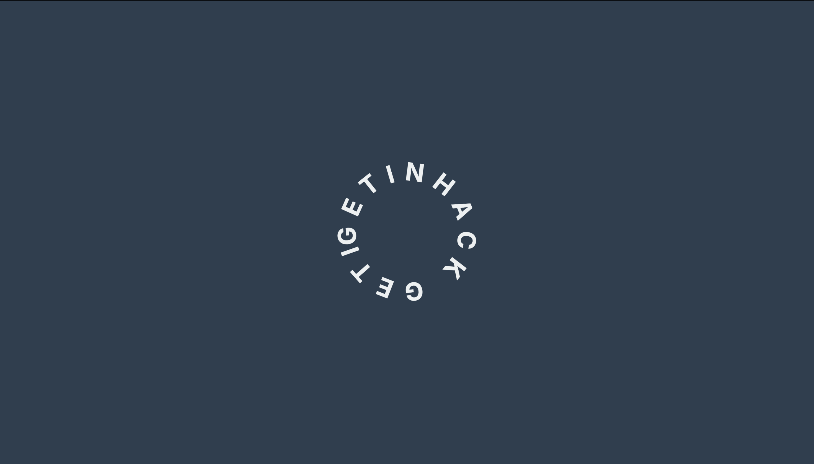
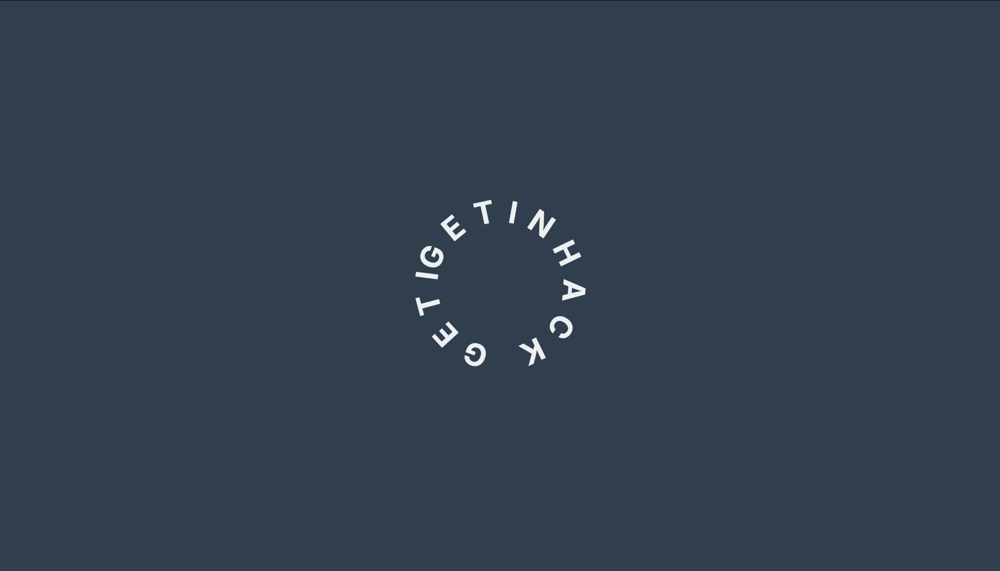
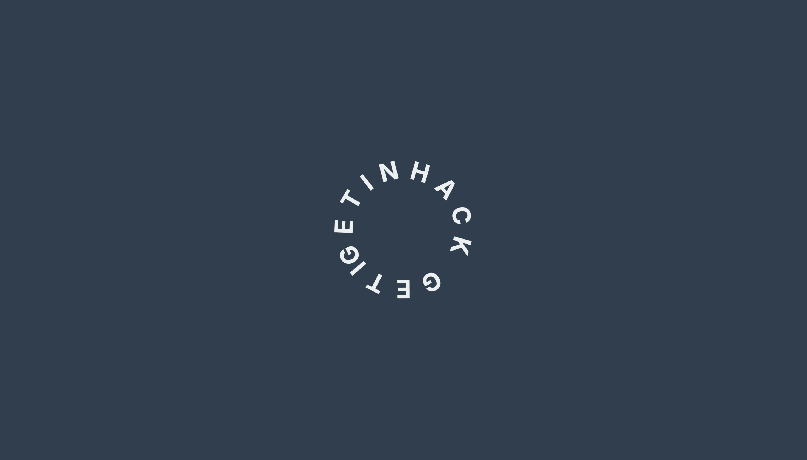

# loading-animation-page
# 🚀 Getinhack Loading Screen

This project is a **simple animated loading screen** built with **HTML, CSS, and SVG**.  
It features a circular spinner with rotating text animation using the `@keyframes` property.

---

## 📸 Preview
  
  
  

---

## 🛠️ Technologies Used
- **HTML5**
- **CSS3 (Animations, Flexbox)**
- **SVG (Text along path)**
- **Google Fonts (Inter)**

---

## 🎯 Features
- Circular animated spinner with custom text (`GETINHACK`).  
- Responsive and centered layout using Flexbox.  
- Smooth infinite rotation effect.  
- Clean dark-themed background with modern typography.  

---

## 📂 Project Structure
├── index.html   # Main HTML file
├── style.css    # Styles (inline in this case)

---

## ▶️ How to Run
1. Clone the repository:
   ```bash
   git clone https://github.com/SaniaDebbarma/loading-animation-page.git
   
cd loading-animation-page

3.	Open index.html in your browser. 🎉

4.	📜 License

This project is licensed under the MIT License – free to use, modify, and share.
✨ Made with ❤️ by Sania Debbarma
